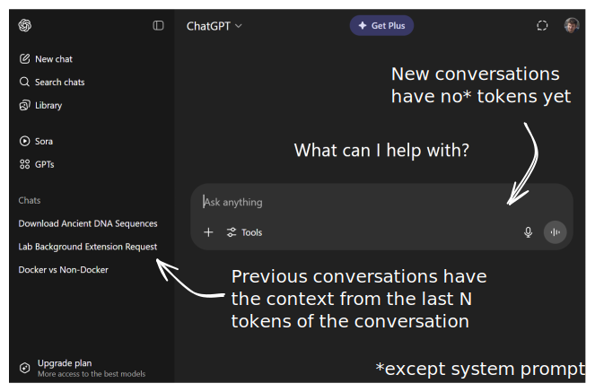

# Practical LLM Primer
---

## What is a large language model (LLM)?

---

### LLM Basics

<iframe width="800" height="471" src="https://www.youtube.com/embed/LPZh9BOjkQs?si=MJzp4-vE3ftz828G&amp;start=0&amp;end=87" title="YouTube video player" frameborder="0" allow="accelerometer; autoplay; clipboard-write; encrypted-media; gyroscope; picture-in-picture; web-share" referrerpolicy="strict-origin-when-cross-origin" allowfullscreen></iframe>

---

Key idea: A LLM is a deep learning model that takes text as input and predicts what text should come next.

---

### Technical note: Tokens

LLMs break down text into **tokens**. Tokens are the basic unit of text in LLMs. 

The process of breaking down text into tokens is called **tokenization**.

---

Tokenization example


---

Each LLM has a vocabulary of tokens that it can use as input.

The vocabulary is fixed for a given LLM.

The number of tokens in the vocabulary is called the **vocabulary size**.

Modern LLMs have vocabulary sizes of ~30k-50k tokens.

---

### LLM Training

<iframe width="800" height="471" src="https://www.youtube.com/embed/LPZh9BOjkQs?si=Wvkxq8YtWh2lAGQJ&amp;start=87&amp;end=135" title="YouTube video player" frameborder="0" allow="accelerometer; autoplay; clipboard-write; encrypted-media; gyroscope; picture-in-picture; web-share" referrerpolicy="strict-origin-when-cross-origin" allowfullscreen></iframe>

---

LLMs:
- Learn which token is most likely to come after an input by being given examples of text.
- Are trained on large amounts of text data using a process called **pre-training**. 

---

### Vector encoding

<iframe width="800" height="471" src="https://www.youtube.com/embed/LPZh9BOjkQs?si=OGzQMx6v5GKqDz59&amp;start=290&amp;end=311" title="YouTube video player" frameborder="0" allow="accelerometer; autoplay; clipboard-write; encrypted-media; gyroscope; picture-in-picture; web-share" referrerpolicy="strict-origin-when-cross-origin" allowfullscreen></iframe>

---

The vector learned for each token is called an **embedding**.

The length of the embedding vector is called the **embedding dimension**.

Modern LLMs have embedding dimensions of ~768-1024.

Embeddings are dense vectors that capture the semantic meaning of input token(s).

---

The matrix of all embeddings is called an **embedding space** or **embedding matrix**.

Each LLM has its own embedding matrix that it learned from the pre-training process.

---

Each token in the input matrix is mapped to a vector index in the vocabulary.

This list of vector indices forms the **token IDs** of the input.

---


The embedding matrix is subsetted based on the token IDs to create the input to the LLM.

---

### Where the magic happens: Attention

<iframe width="800" height="471" src="https://www.youtube.com/embed/LPZh9BOjkQs?si=OGzQMx6v5GKqDz59&amp;start=310&amp;end=388" title="YouTube video player" frameborder="0" allow="accelerometer; autoplay; clipboard-write; encrypted-media; gyroscope; picture-in-picture; web-share" referrerpolicy="strict-origin-when-cross-origin" allowfullscreen></iframe>

---

**Attention** is the key to LLMs.

It allows the model to focus on different parts of the input when making predictions about what tokens should come next.

After the attention mechanism is applied, the model creates a **"hidden state"** matrix that adjusted the input embeddings based to incorporate the other tokens in the input.

The hidden state is then used to make predictions about what tokens should come next.

---


---

Training models from scratch is a very expensive and time consuming process.

**Inference** (i.e. using a trained model to generate text) is much faster.

When we interact with a LLM, the model is performing **inference**.

---

### Practically, LLMs have two components:

- Architecture (i.e. the deep learning model)
- Parameters / Weights (organized as matrices)

---

### Architecture

- LLM architectures have three key parameters:
    - *N* - maximum number of tokens (aka context window size)
    - *D* - embedding dimension
    - *S* - token vocabulary size
- These are chosen by the model designer and set at training time

---

### Parameters / Weights

- Parameters / Weights are:
    - Real valued numbers, typically in the range [-0.1,0.1]
    - Learned from a specific corpus of training text
    - Organized into many matrices based on the architecture
    - Models labeled by total number of parameters throughout entire model (e.g. 0.6B, 14B, 671B)

---

Training LLMs from scratch is a very expensive and time consuming process.

Only a few companies and institutions have the resources to train LLMs from scratch.

These models are called **"Foundation Models"**.

They differ in their architecture, parameters, and training data.

---

### Availability

LLMs are one of:

- Closed source - neither the weights nor the source code are available for download
- Open weights - the weights are available for download for free, the training code is not
- Open source - the source code that trained the model is available for download for free

---

### Fine-tuning

Open weight models can be **fine-tuned**.

This means that the weights can be adjusted to perform a specific task.

This is a much faster and less expensive process than training a model from scratch.

---

# Practical Guide to Using LLMs

---

## Context

---

The input passed to an LLM is called the **context**.

The context is like "short term memory" - the model can only remember a limited amount of information at once.

Without being given additional capabilities, LLMs have no "long term memory" per se.

---

Each LLM has a fixed number of tokens it can "see" at once (*N* from previous).

This is called the **context window size**.

For example, if *N*=1024, then the model can only see 1024 tokens at once.

If the input is longer than *N*, the model will only see the last *N* tokens.

The *N* tokens currently visible to the model are called the **context window**.

---



---

## The Prompt

---

The **prompt** is the text input to the LLM.

The attention mechanism ensures all information within the context window influences the output.

The accuracy and usefulness of a response depends on the quality of the prompt.

---

The prompt generally has two components:

1. **System prompt** - instructions for the LLM on how to answer questions
2. **User prompt** - the actual question or task

The system prompt is optional, but it is often used to guide the LLM's behavior.

The user prompt is required.

---

### Prompt Example

System prompt:
```
You are a helpful assistant and expert in world history
and geography.
```

User prompt:
```
What is the capital of France?
```

---

The whole prompt is passed to the LLM as context:

```
System: You are a helpful assistant and expert in world history
and geography.

User: What is the capital of France?
```

---

### Prompt Engineering

The quality of the prompt is critical to the success of the LLM.

The process of creating a good prompt is called **prompt engineering**.

The idea is to give the LLM *enough* of the *right* information to answer the question or perform the task.

---

When the LLM responds, **its output is added to the context** and awaits user input.

The process repeats until the user is satisfied with the response.

User responses are concatenated to the context and the entire context is passed to the LLM as input.

---

```
System: You are a helpful assistant and expert in world history
and geography.

User: What is the capital of France?

Assistant: The capital of France is **Paris**. It’s a global
center for art, fashion, gastronomy, and culture, and a hugely
important historical city – it’s been the seat of French power
for centuries!  Do you want to know anything more about Paris,
or perhaps another city in France?
```

NB: You won't typically see the role labels (e.g. "System", "User", "Assistant") in chatbots.

---

### Context Engineering

"Prompt engineering" has been subsumed into "context engineering".

Context engineering is the process of creating a good context for an LLM which includes but is not limited to the user prompt.

---

# Summary

---

1. LLMs are deep learning models that take text as input and predict what text should come next.
2. LLMs are trained to recognize patterns in text using large amounts of text data.
3. The attention mechanism is responsible for tailoring predictions to the given context.
4. LLMs differ based on their architecture, parameters, and training data.

---

5. The **context** is the text that the applies the attention mechanism to.
6. The **prompt** is the user input to the LLM and is critical to its behavior.

---

# Backup

---

### Pretraining process

<iframe width="800" height="471" src="https://www.youtube.com/embed/LPZh9BOjkQs?si=awG8hc5yTDTfcLNm&amp;start=135&amp;end=225" title="YouTube video player" frameborder="0" allow="accelerometer; autoplay; clipboard-write; encrypted-media; gyroscope; picture-in-picture; web-share" referrerpolicy="strict-origin-when-cross-origin" allowfullscreen></iframe>

---

<iframe width="800" height="471" src="https://www.youtube.com/embed/LPZh9BOjkQs?si=OGzQMx6v5GKqDz59&amp;start=310&amp;end=336" title="YouTube video player" frameborder="0" allow="accelerometer; autoplay; clipboard-write; encrypted-media; gyroscope; picture-in-picture; web-share" referrerpolicy="strict-origin-when-cross-origin" allowfullscreen></iframe>